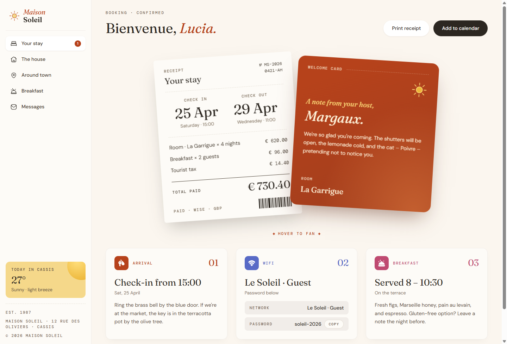

# Frontend Mentor - Hotel booking confirmation page solution

This is a solution to the [Hotel booking confirmation page challenge on Frontend Mentor](https://www.frontendmentor.io/challenges). Frontend Mentor challenges help you improve your coding skills by building realistic projects.

## Table of contents

- [Overview](#overview)
    - [The challenge](#the-challenge)
    - [Screenshot](#screenshot)
    - [Links](#links)
- [My process](#my-process)
    - [Built with](#built-with)
- [Author](#author)

## Overview

### The challenge

Users should be able to:

- View the optimal layout for the interface depending on their device's screen size
- See hover and focus states for all interactive elements on the page
- Open and close the navigation menu on smaller screens
- Copy the Wi-Fi password to their clipboard using the copy button
- (Bonus) Fan out the receipt and host-note cards on hover
- (Bonus) Print a clean receipt view via the "Print receipt" button
- (Bonus) Download an .ics calendar file for the stay via "Add to calendar"

### Screenshot

### Links

- Solution URL: [Vercel](https://hotel-booking-confirmation-page-main.vercel.app/)
- Live Site URL: [mmalabugin.ru/HotelBookingConfirmationPage](https://mmalabugin.ru/HotelBookingConfirmationPage/)

## My process

### Built with

- Semantic HTML5 markup
- CSS custom properties
- Flexbox and CSS Grid
- Mobile-first workflow
- Pixel-perfect layout measured directly from the design JPGs
- Local variable fonts (Fraunces, DM Sans, DM Mono) with `font-display: optional` and preloads to avoid layout shift
- [Vue](https://vuejs.org/) 3 (`<script setup>`) + TypeScript + [Vite](https://vite.dev/)

## Author

- Website - [mmalabugin.ru](https://mmalabugin.ru/)
- Frontend Mentor - [@1t1sCooL](https://www.frontendmentor.io/profile/1t1sCooL)
- Twitter - [@vi_el_mar](https://www.twitter.com/vi_el_mar)
- Telegram - [@ItIsCooL](https://t.me/ItIsCooL)
